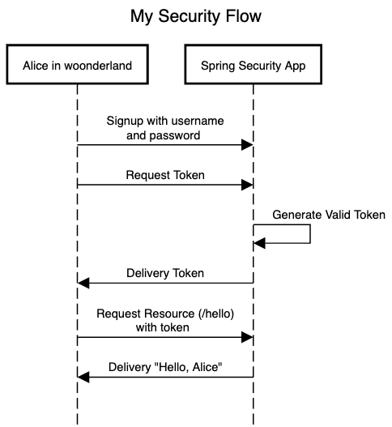

# Spring Security Project Laboratory

This project aims to test Spring Security 6 OAuth2 with JWT using JDBC Token Storage, implemented in Kotlin with Gradle.

The diagram below illustrates my understanding of the required security flow.

While using Spring Security 6, I encountered some implementation challenges. In previous versions, it was not necessary to manually implement token retrieval and validation in the resource server. These implementations are now included in AuthController.kt.

To handle exceptions, I found that creating a filter was the only viable option, as RestControllerAdvice does not catch exceptions during token validation.

Please feel free to open issues to discuss these topics further. Your contributions are greatly appreciated.
